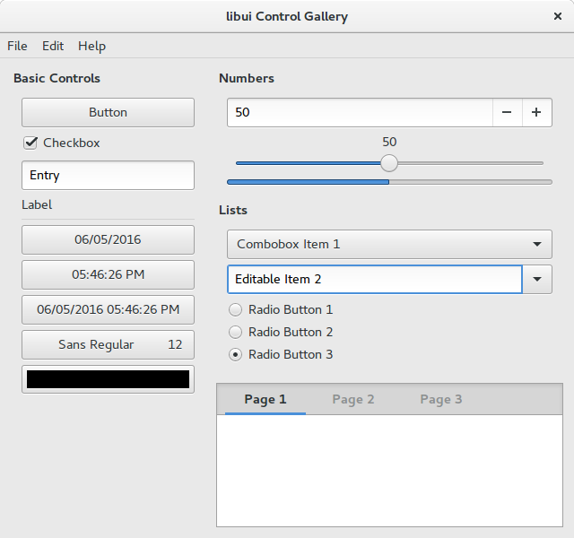

# libui: a portable GUI library for C

This README is being written.<br>
[](https://travis-ci.org/andlabs/libui)
*(currently failing because the version of cmake that Travis uses treats Objective-C files as C++; if you know the fix please file a PR)*

## Announcements

* **5 June 2016**
	* **Alpha 3.1 is here.** This was a much-needed update to Alpha 3 that changes a few things:
		* **The build system is now cmake.** cmake 2.8.11 or higher is needed.
		* Static linking is now fully possible.
		* MinGW linking is back, but static only.

*Old announcements can be found in the ANNOUNCE.md file.*

## Updates

*Note that today's entry may be updated later today.*

* **13 June 2016**
	* `intmax_t` and `uintmax_t` are no longer used in libui at all; now we only have `int`. This should make things much easier for bindings. `int` should be at least 32 bits wide; this should be sufficient for all but the most extreme cases.

* **12 June 2016**
	* Added `uiGrid`, a new container control that arranges controls in rows and columns, with stretchy ("expanding") rows, stretchy ("expanding") columns, cells that span rows and columns, and cells whose content is aligned in either direction rather than just filling. It's quite powerful, is it? =P

* **8 June 2016**
	* Added `uiForm`, a new container control that arranges controls vertically, with properly aligned labels on each. Have fun!

* **6 June 2016**
	* Added `uiRadioButtonsSelected()`, `uiRadioButtonsSetSelected()`, and `uiRadioButtonsOnSelected()` to control selection of a radio button and catch an event when such a thing happens.

* **5 June 2016**
	* Added `uiNewPasswordEntry()`, which creates a new `uiEntry` suitable for entering passwords.
	* Added `uiNewSearchEntry()`, which creates a new `uiEntry` suitable for searching. On some systems, the `OnChanged()` event will be slightly delayed and/or combined, to produce a more natural feel when searching.

*Old updates can be found in the Changelog.md file.*

## Runtime Requirements

* Windows: Windows Vista SP2 with Platform Update or newer
* Unix: GTK+ 3.10 or newer
* Mac OS X: OS X 10.8 or newer

## Build Requirements

* All platforms:
	* CMake 2.8.11 or newer
* Windows: either
	* Microsoft Visual Studio 2013 or newer (2013 is needed for `va_copy()`) — you can build either a static or a shared library
	* MinGW-w64 (other flavors of MinGW may not work) — **you can only build a static library**; shared library support will be re-added once the following features come in:
		* [Isolation awareness](https://msdn.microsoft.com/en-us/library/aa375197%28v=vs.85%29.aspx), which is how you get themed controls from a DLL without needing a manifest
* Unix: nothing else specific
* Mac OS X: nothing else specific, so long as you can build Cocoa programs

## Building

Out-of-tree builds typical of cmake are preferred:

```
$ # you must be in the top-level libui directory, otherwise this won't work
$ mkdir build
$ cd build
$ cmake ..
```

Pass `-DBUILD_SHARED_LIBS=OFF` to `cmake` to build a static library. The standard cmake build configurations are provided; if none is specified, `Debug` is used.

If you use a makefile generator with cmake, then

```
$ make
$ make tester         # for the test program
$ make examples       # for examples
```

and pass `VERBOSE=1` to see build commands. Build targets will be in the `build/out` folder.

Project file generators should work, but are untested by me.

On Windows, I use the `Unix Makefiles` generator and GNU make (built using the `build_w32.bat` script included in the source and run in the Visual Studio command line). In this state, if MinGW-w64 (either 32-bit or 64-bit) is not in your `%PATH%`, cmake will use MSVC by default; otherwise, cmake will use with whatever MinGW-w64 is in your path. `set PATH=%PATH%;c:\msys2\mingw(32/64)\bin` should be enough to temporarily change to a MinGW-w64 build for the current command line session only if you installed MinGW-w64 through [MSYS2](https://msys2.github.io/); no need to change global environment variables constantly.

## Installation

#### Arch Linux

Can be built from AUR: https://aur.archlinux.org/packages/libui-git/

## Documentation

Needs to be written. Consult ui.h and the examples for details for now.

## Language Bindings

libui was originally written as part of my [package ui for Go](https://github.com/andlabs/ui). Now that libui is separate, package ui has become a binding to libui. As such, package ui is the only official binding.

Other people have made bindings to other languages:

Language | Bindings
--- | ---
C#/.net | [LibUI.Binding](https://github.com/NattyNarwhal/LibUI.Binding), [SharpUI](https://github.com/benpye/sharpui/)
Crystal | [libui.cr](https://github.com/Fusion/libui.cr)
D | [DerelictLibui](https://github.com/Extrawurst/DerelictLibui)
Euphoria | [libui-euphoria](https://github.com/ghaberek/libui-euphoria)
Haskell | [libui-haskell](https://github.com/ajnsit/libui-haskell)
JavaScript | [libui.js (merged into libui-node?)](https://github.com/mavenave/libui.js)
Julia | [Libui.jl](https://github.com/joa-quim/Libui.jl)
Lua | [libuilua](https://github.com/zevv/libuilua), [libui-lua](https://github.com/mdombroski/libui-lua)
Nim | [ui](https://github.com/nim-lang/ui)
Node.js | [libui-node](https://github.com/parro-it/libui-node)
Python | [pylibui](https://github.com/joaoventura/pylibui)
Ruby | [libui-ruby](https://github.com/jamescook/libui-ruby)
Rust | [libui-rs](https://github.com/pcwalton/libui-rs)

## Screenshots

From examples/controlgallery:





